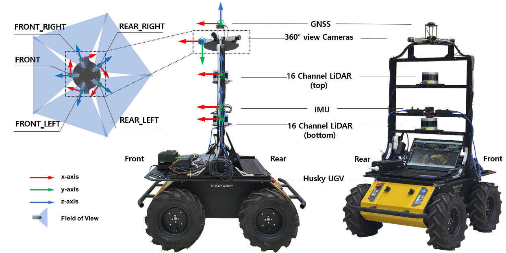

<h1>SiT Dataset: Socially Interactive Pedestrian Trajectory Dataset</h1>


## Updates
* [2023-05-29] We opened SiT Dataset github.
* [2023-06-02] Mini set of 'SiT Dataset' is released on public.
* [2023-06-03] ROS bagfile of SiT miniset Dataset is released on public.
* [2023-06-07] We uploaded pretrained models for 3D object detection.

## Overview
To ensure safe and reliable mobility in spaces shared by humans and robots, social navigation robots must accurately recognize and predict the trajectories of nearby pedestrians. In this paper, we present a novel dataset of pedestrian trajectories, referred to as Social Interactive Trajectory (SiT) dataset, which can be used to train pedestrian detection, tracking, and trajectory prediction models needed to design social navigation robots. Thus far, various human trajectory datasets have been released to support the development of pedestrian motion forecasting models. However, our SiT dataset differs from other datasets in the following two respects. Whereas the pedestrian trajectory data in other datasets was obtained from static scenes, our data was collected while the robot moves in a crowded environment, capturing human-robot interactive scenarios in motion. Furthermore, our dataset includes raw data captured by two scanning LiDARs and five cameras covering a 360-degree view, an Inertial Measurement Unit (IMU) sensor, and Real-Time Kinematic Positioning (RTK), as well as annotations including 2D \& 3D boxes, object classes, and object IDs. Rather than designing the dataset according to individual tasks, we have structured it such that it can be uniformly used across all tasks. Consequently, the SiT dataset can be used to train and test the end-to-end models performing 3D perception, multiple object tracking, and trajectory prediction tasks jointly. We present the performances of baseline models for all three tasks. Our dataset and models provide a strong foundation for future research in pedestrian trajectory prediction, which could expedite the development of safe and agile social navigation robots.

## Robot Platform & Sensor Setup


* <a href="https://clearpathrobotics.com/husky-unmanned-ground-vehicle-robot/"> Clearpath Husky UGV </a>
* Velodyne VLP-16 * 2
* RGB Camera Basler a2A1920-51gv PRO GigE * 5
* MIi-680 IMU & GPS


### 3D Object Detection
This is the document for how to use our dataset for various perception tasks.
We tested the SiT Dataset for detection frameworks on the following enviroment:
* Python 3.8.13 (3.10+ does not support open3d.)
* Ubuntu 18.04/20.04
* Torch 1.11.0+cu113
* CUDA 11.3
* opencv 4.2.0.32

### 3D Multi-Object Tracking(3DMOT)
This is the document for how to use our dataset for various perception tasks.
We tested the SiT Dataset for Tracking frameworks on the following enviroment:
* Python 3.8.13 (3.10+ does not support open3d.)
* Ubuntu 18.04/20.04
* Torch 1.11.0+cu113
* CUDA 11.3
* opencv 4.2.0.32

### Pedestrian Trajectory Prediction
This is the document for how to use our dataset for various perception tasks.
We tested the SiT Dataset for prediction frameworks on the following enviroment:
* Python 3.8.13 (3.10+ does not support open3d.)
* Ubuntu 18.04/20.04
* Torch 1.11.0+cu113
* CUDA 11.3
* opencv 4.2.0.32


## Model Zoo
We provide pretrained models for 3D pedestrian detection, Pedestrian Trajectory Prediction and end-to-end Prediction.
### 3D Object Detection
|Modal|Name|mAP| dist 0.25 |dist 0.5 | dist 1.0 | dist 2.0 | dist 4.0 | - | Pretrained |
|:---:|:---:|:---:|:---:|:---:|:---:|:---:|:---:|:---:|:---:|
|Camera|FCOS3D| - | - | - | - | - | - | - |<a href="">Link</a>|
|Camera|BEVFormer| - | - | - | - | - | - | - |<a href="">Link</a>|
|LiDAR|PointPillars| - | - | - | - | - | - | - |<a href="">Link</a>|
|LiDAR|SECOND| - | - | - | - | - | - | - |<a href="">Link</a>|
|LiDAR|CenterPoint| - | - | - | - | - | - | - |<a href="">Link</a>|
|Fusion|Transfusion| - | - | - | - | - | - | - |<a href="">Link</a>|
|Fusion|BEVFusion| - | - | - | - | - | - | - |<a href="">Link</a>|

### Pedestrian Trajectory Prediction
|Name|Map|ADE|FDE| - | - | - | - | - |Pretrained|
|:---:|:---:|:---:|:---:|:---:|:---:|:---:|:---:|:---:|:---:|
|Vanilla LSTM|x| - | - | - | - | - | - | - |<a href="">Link</a>|
|Social-LSTM|x| - | - | - | - | - | - | - |<a href="">Link</a>|
|Y-NET|x| - | - | - | - | - | - | - |<a href="">Link</a>|
|Y-NET|o| - | - | - | - | - | - | - |<a href="">Link</a>|
|NSP|x| - | - | - | - | - | - | - |<a href="">Link</a>|
|NSP|o| - | - | - | - | - | - | - |<a href="">Link</a>|

### End-to-End Pedestrian Trajectory Prediction
|Name|Map| AP | FAP_MR | AR | FAP | FAR | AAP | AAR | ATE | ASE | AOE | AVE | AAE | ADE | FDE | MR |Pretrained|
|:---:|:---:|:---:|:---:|:---:|:---:|:---:|:---:|:---:|:---:|:---:|:---:|:---:|:---:|:---:|:---:|:---:|:---:|
|FaF|x| - | - | - | - | - | - | - | - | - | - | - | - | - | - | - |<a href="">Link</a>|
|FutureDet|x| - | - | - | - | - | - | - | - | - | - | - | - | - | - | - |<a href="">Link</a>|
|FutureDet|o| - | - | - | - | - | - | - | - | - | - | - | - | - | - | - |<a href="">Link</a>|

## Download Dataset
You can download full dataset and raw rosbag files from below.
<a href="https://eddie-jub.github.io/test/"> Download link </a>


## ROS Bag Raw Data
ROS bagfiles include below sensor data:
Topic Name | Message Tpye | Message Descriptison
------------ | ------------- | ---------------------------------
/29_camera/pylon_camera_node/image_raw/compressed  | sensor_msgs/CompressedImage  | Compressed Bayer Image by Basler a2A1920-51gv PRO GigE
/41_camera/pylon_camera_node/image_raw/compressed  | sensor_msgs/CompressedImage  | Compressed Bayer Image by Basler a2A1920-51gv PRO GigE
/46_camera/pylon_camera_node/image_raw/compressed  | sensor_msgs/CompressedImage  | Compressed Bayer Image by Basler a2A1920-51gv PRO GigE
/47_camera/pylon_camera_node/image_raw/compressed  | sensor_msgs/CompressedImage  | Compressed Bayer Image by Basler a2A1920-51gv PRO GigE
/65_camera/pylon_camera_node/image_raw/compressed  | sensor_msgs/CompressedImage  | Compressed Bayer Image by Basler a2A1920-51gv PRO GigE
/bottom/velodyne_points | sensor_msgs/PointCloud2 | Pointcloud by Velodyne VLP-16
/top/velodyne_points | sensor_msgs/PointCloud2 | Pointcloud by Velodyne VLP-16
/xsens/filter/positionlla  | geometry_msgs/Vector3Stamped | GNSS by MIi-680
/xsens/imu/data      | sensor_msgs/Imu | GNSS by MIi-680
 /xsens/imu_interpolated   | | sensor_msgs/Imu | GNSS by MIi-680

## Citation
```
@misc{sitdataset,
      title={SiT Dataset: Data, Benchmarks and Analysis}, 
      author={Jongwook Bae, Jungho Kim, Junyong Yun, Changwon Kang, Junho Lee, Jeongseon Choi, Chanhyeok Kim, and Jun-Won Choi},
      year={2023},
      eprint={},
      archivePrefix={arXiv},
      primaryClass={cs.CV}
}
```

## Acknowledgement
The SiT dataset is contributed by [Jongwook Bae](https://github.com/Eddie-JUB), [Jungho Kim](https://github.com/SPA-junghokim), [Junyong Yun](https://github.com/JunyongYun-SPA), [Changwon Kang](https://github.com/rkdckddnjs9), [Junho Lee](https://github.com/jhlee-ai), [Jeongseon Choi](https://github.com/junction824), [Chanhyeok Kim](), advised by [Jun-Won Choi](https://www.spa.hanyang.ac.kr/faculty).
<!--다른 모델 저자들 링크  -->
We thank the maintainers of the following projects that enable us to develop SiT Dataset: ['MMDetection'](https://github.com/open-mmlab/mmdetection) and [`OpenPCDet`](https://github.com/open-mmlab/OpenPCDet) by MMLAB
