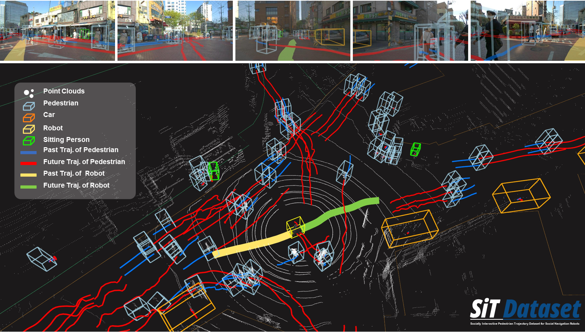
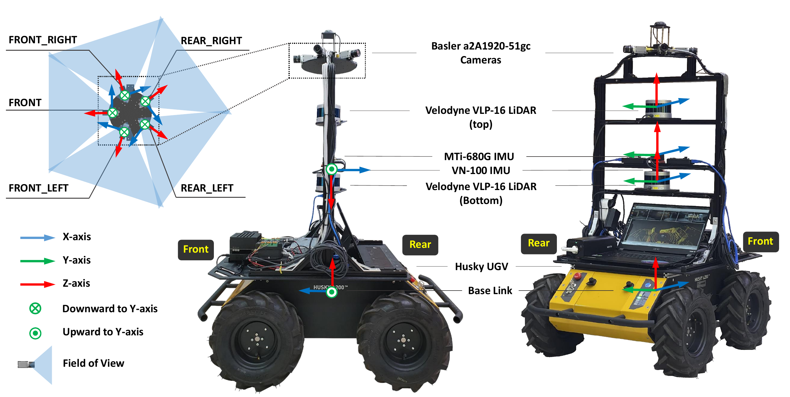

<h1> <a href="https://spalaboratory.github.io/SiT/"> SiT Dataset: Socially Interactive Pedestrian Trajectory Dataset for Social Navigation Robots </a> </h1>

<!-- <p align="center">
  <a href="https://www.spa.hanyang.ac.kr/ " target="_blank">
    
  </a>
  <a href="https://www.hanyang.ac.kr/web/eng" target="_blank">
    
  </a>
</p>
 -->
 
<p align="center">
  </br>
  <a href="https://spalaboratory.github.io/SiT">
    
  </a>
</br></br>
</p>

<p align="center">
<a href="https://youtu.be/9zc-5Gxjvzk"></a>
<!-- <a href="https://drive.google.com/drive/folders/1kYGPJPoWn3J8s0mRWXZv9X-MOR5Hcg8u"></a> -->
<a href="https://openreview.net/forum?id=gMYsxTin4x"></a>
<a href="https://spalaboratory.github.io/SiT/"></a>
</p>

<!--  -->

<p align="center">
  
   <em align="center">Example of SiT dataset</em>
</p>


## Updates
* [2024-10] The Google form link for download has been changed. <a href="https://docs.google.com/forms/u/3/d/e/1FAIpQLSfsMQq5Ob2NI1aV96C7NhnMtXvBshJvbuegVeQ5B3KETNv0FQ/viewform?usp=send_form">Google Form</a>
* [2024-06] The final dataset is released! Download it via the link at the end of the Google Form. <a href="https://forms.gle/6iBSnRakR9wwpbkL8">Google Form</a>
* [2023-09] Our paper is accepted to NeurIPS 2023 Dataset and Benchmark Track! <a href="https://openreview.net/forum?id=gMYsxTin4x">Paper Link</a>
* [2023-06] Semantic map data of SiT Dataset released on <a href="https://github.com/SPALaboratory/SiT-Dataset/tree/main/semantic-maps">Github.</a>
* [2023-05] We opened SiT Dataset <a href="https://github.com/SPALaboratory/SiT-Dataset">Github</a>.
* [2023-05] We opened SiT Dataset <a href="https://spalaboratory.github.io/SiT/">Website.</a>
<!-- * [2023-07] SiT benchmark and devkit for each perception task release on <a href="https://github.com/SPALaboratory/SiT-Dataset">Github</a>. -->
<!-- * [2023-07] Dockerfiles for each perception task release on <a href="https://hub.docker.com/u/spalaboratory">Dockerhub</a>. -->
<!-- * [2023-07] <a href="https://drive.google.com/drive/folders/1kYGPJPoWn3J8s0mRWXZv9X-MOR5Hcg8u?usp=sharing">SiT Mini-Dataset</a> release on public. -->
<!-- * [2023-06] SiT mini Dataset released on <a href="https://drive.google.com/drive/folders/1kYGPJPoWn3J8s0mRWXZv9X-MOR5Hcg8u"> Google Drive.</a> -->

## Upcomings
* [2024-09] Trained weights and updated code for 3D object detection and Trajectory prediction release on public.
<!-- * [2024-07] Updated mini dataset release. -->
<!-- * [2024-09] SiT End-to-End pedestrain trajectory prediction challenge starts on <a href='https://eval.ai/web/challenges/list'>Eval AI</a>. -->
<!-- * [2023-07] Pretrained models for 3D object detection. -->
<!-- * [2023-09] SiT Full dataset upload. -->
<!-- * [2023-07] ROS bagfile of SiT Full dataset upload. -->
<!-- * [2023-08] SiT benchmark for end-to-end trajectory prediction release. -->


## Overview
Our Social Interactive Trajectory (SiT) dataset is a unique collection of pedestrian trajectories for designing advanced social navigation robots. It includes a range of sensor data, annotations, and offers a unique perspective from a robot navigating crowded environments, capturing dynamic human-robot interactions. It's meticulously organized for training and evaluating models across tasks like 3D detection, 3D multi-object tracking, and trajectory prediction, providing an end-to-end modular approach. It includes a comprehensive benchmark and exhibits the performance of several baseline models. This dataset is a valuable resource for future pedestrian trajectory prediction research, supporting the development of safe and agile social navigation robots.

## Robot Platform & Sensor Setup

* Ubuntu 18.04 LTS
* ROS Melodic
* <a href="https://clearpathrobotics.com/husky-unmanned-ground-vehicle-robot/"> Clearpath Husky UGV </a>
* Velodyne VLP-16 * 2
* RGB Camera Basler a2A1920-51gc PRO GigE * 5
* MTi-680G IMU & GPS * 1
* VectorNAV VN-100 IMU * 1


## Ground Truth
We provide GT boxes for 2D and 3D data as below.
* 2D: Class name, Track ID, Camera number, Top left X coordinate, Top left Y coordinate, Width (w), and Height (h)
* 3D: Class name, Track ID, Height (h), Length (l), Width (w), X, Y, and Z coordinates, and rotation (rot).


<!-- 
### 3D Object Detection
This is the document for how to use our dataset for various perception tasks.
We tested the SiT Dataset for detection frameworks on the following enviroment:
* Python 3.8.13 (3.10+ does not support open3d.)
* Ubuntu 18.04/20.04
* Torch 1.11.0+cu113
* CUDA 11.3
* opencv 4.2.0.32

### 3D Multi-Object Tracking(3DMOT)
This is the document for how to use our dataset for various perception tasks.
We tested the SiT Dataset for Tracking frameworks on the following enviroment:
* Python 3.8.13 (3.10+ does not support open3d.)
* Ubuntu 18.04/20.04
* Torch 1.11.0+cu113
* CUDA 11.3
* opencv 4.2.0.32

### Pedestrian Trajectory Prediction
This is the document for how to use our dataset for various perception tasks.
We tested the SiT Dataset for prediction frameworks on the following enviroment:
* Python 3.8.13 (3.10+ does not support open3d.)
* Ubuntu 18.04/20.04
* Torch 1.11.0+cu113
* CUDA 11.3
* opencv 4.2.0.32 -->


## Benchmarks
We provide benchmarks and weights of trained models for 3D pedestrian detection, 3D Multi-Object Tracking, Pedestrian Trajectory Prediction and End-to-End Motion Forecasting.

### <a href="https://github.com/SPALaboratory/SiT-Dataset/tree/main/detection">3D Object Detection</a>

|**Methods**|**Modality**|**mAP &uarr;**| **AP(0.25) &uarr;** |**AP(0.5) &uarr;** | **AP(1.0) &uarr;** | **AP(2.0) &uarr;** | **Trained** |
|:---:|:---:|:---:|:---:|:---:|:---:|:---:|:---:|
|**<a href="https://www.arxiv-vanity.com/papers/2104.10956/">FCOS3D</a>**|Camera| 0.170 | 0.000 | 0.037 | 0.219 | 0.423 | <a href="https://drive.google.com/file/d/1RttgPBNatAI2Nm6po2IzvLQPS2rU3Y3-/view?usp=sharing">Gdrive</a>|
|**<a href="https://ojs.aaai.org/index.php/AAAI/article/view/25233/">BEVDepth</a>**|Camera| 0.270 | 0.019 | 0.183 | 0.361 | 0.516 | <a href="https://drive.google.com/file/d/1AQ1dtYa0C5jyxQZYXg096XuIi-PaBgVJ/view?usp=sharing">Gdrive</a>|
|**<a href="https://openaccess.thecvf.com/content_CVPR_2019/html/Lang_PointPillars_Fast_Encoders_for_Object_Detection_From_Point_Clouds_CVPR_2019_paper.html">PointPillars</a>**|LiDAR| - | - | - | - | - |<a href="">TBD</a>|
|**<a href="https://openaccess.thecvf.com/content/CVPR2021/html/Yin_Center-Based_3D_Object_Detection_and_Tracking_CVPR_2021_paper.html">CenterPoint-P</a>**|LiDAR| - | - | - | - | - |<a href="">TBD</a>|
|**<a href="https://openaccess.thecvf.com/content/CVPR2021/html/Yin_Center-Based_3D_Object_Detection_and_Tracking_CVPR_2021_paper.html">CenterPoint-V</a>**|LiDAR| - | - | - | - | - |<a href="">TBD</a>|
|**<a href="https://openaccess.thecvf.com/content/CVPR2022/html/Bai_TransFusion_Robust_LiDAR-Camera_Fusion_for_3D_Object_Detection_With_Transformers_CVPR_2022_paper.html">Transfusion-P</a>**|Fusion| - | - | - | - | - |<a href="">TBD</a>|
|**<a href="https://openaccess.thecvf.com/content/CVPR2022/html/Bai_TransFusion_Robust_LiDAR-Camera_Fusion_for_3D_Object_Detection_With_Transformers_CVPR_2022_paper.html">Transfusion-V</a>**|Fusion|- | - | - | - | - |<a href="">TBD</a>|

### <a href="https://github.com/SPALaboratory/SiT-Dataset/tree/main/tracking">3D Multi-Object Trajectory Tracking</a>


|**Method**| **sAMOTA&uarr;** | **AMOTA&uarr;** | **AMOTP(m)&darr;** | **MOTA&uarr;**| **MOTP(m)&darr;** | **IDS&darr;** |
|:---:|:---:|:---:|:---:|:---:|:---:|:---:|
|**<a href="https://openaccess.thecvf.com/content_CVPR_2019/html/Lang_PointPillars_Fast_Encoders_for_Object_Detection_From_Point_Clouds_CVPR_2019_paper.html">PointPillars</a> + <a href="https://arxiv.org/abs/2008.08063">AB3DMOT</a>** | - | - | - | - | - | - |
|**<a href="https://openaccess.thecvf.com/content/CVPR2021/html/Yin_Center-Based_3D_Object_Detection_and_Tracking_CVPR_2021_paper.html">Centerpoint Detector</a> + <a href="https://arxiv.org/abs/2008.08063">AB3DMOT</a>** |- | - | - | - | - | - |
|**<a href="https://openaccess.thecvf.com/content/CVPR2021/html/Yin_Center-Based_3D_Object_Detection_and_Tracking_CVPR_2021_paper.html">Centerpoint Tracker</a>** | - | - | - | - | - | - |

### <a href="https://github.com/SPALaboratory/SiT-Dataset/tree/main/prediction">Pedestrian Trajectory Prediction</a>

<!-- |**Vanilla LSTM**| X|1.156 | 2.205 | 1.601 | 3.157 | <a href="">TBD</a>| -->
|**Name**|**Map**|**ADE<sub>5<sub>** **&darr;**|**FDE<sub>5<sub>** **&darr;**| **ADE<sub>20<sub>** **&darr;** | **FDE<sub>20<sub>** **&darr;** | **Trained** |
|:---:|:---:|:---:|:---:|:---:|:---:|:---:|
|**<a href="https://openaccess.thecvf.com/content_cvpr_2016/html/Alahi_Social_LSTM_Human_CVPR_2016_paper.html">Social-LSTM</a>**| X | 1.781 | 2.816 | 1.683 | 2.722 | <a href="">TBD</a>|
|**<a href="https://openaccess.thecvf.com/content/ICCV2021/html/Mangalam_From_Goals_Waypoints__Paths_to_Long_Term_Human_Trajectory_ICCV_2021_paper.html">Y-NET</a>**| X | - | - | - | - | <a href="">TBD</a>|
|**<a href="https://openaccess.thecvf.com/content/ICCV2021/html/Mangalam_From_Goals_Waypoints__Paths_to_Long_Term_Human_Trajectory_ICCV_2021_paper.html">Y-NET</a>**| O | - | - | - | - | <a href="">TBD</a>|
  |**<a href="https://link.springer.com/chapter/10.1007/978-3-031-19830-4_22">NSP-SFM</a>**| X | 1.451 | 2.329 | 0.812 | 1.331  | <a href="">TBD</a>|
|**<a href="https://link.springer.com/chapter/10.1007/978-3-031-19830-4_22">NSP-SFM</a>**| O | 0.883 | 1.809 | 0.624 | 1.237 | <a href="">TBD</a>|

### End-to-End Pedestrian Motion Forecasting
|**Method**| **mAP** **&uarr;** |  **mAP<sub>f<sub>** **&uarr;** | **ADE<sub>5<sub>** **&darr;** | **FDE<sub>5<sub>** **&darr;** | **Trained** |
|:---:|:---:|:---:|:---:|:---:|:---:|
|**<a href="https://openaccess.thecvf.com/content_cvpr_2018/html/Luo_Fast_and_Furious_CVPR_2018_paper.html">Fast and Furious</a>**| - | - | - | - |<a href="">TBD</a>|
|**<a href="https://openaccess.thecvf.com/content/CVPR2022/html/Peri_Forecasting_From_LiDAR_via_Future_Object_Detection_CVPR_2022_paper.html">FutureDet-P</a>**|- | - | - | -|<a href="">TBD</a>|
|**<a href="https://openaccess.thecvf.com/content/CVPR2022/html/Peri_Forecasting_From_LiDAR_via_Future_Object_Detection_CVPR_2022_paper.html">FutureDet-V</a>**|- | - | - | -|<a href="">TBD</a>|

## Download Dataset
* Download Full dataset via the link at the end of the Google Form. <a href="https://docs.google.com/forms/u/3/d/e/1FAIpQLSfsMQq5Ob2NI1aV96C7NhnMtXvBshJvbuegVeQ5B3KETNv0FQ/viewform?usp=send_form">Google Form</a>
<!-- 이전 주소 <a href="https://forms.gle/6iBSnRakR9wwpbkL8">Google Form</a> -->


<!--
## ROS Bag Raw Data
ROS bagfiles include below sensor data:
| Topic Name | Message Type | Message Descriptison |
:------------ | :------------- | :---------------------------------
/29_camera/pylon_camera_node/<br>image_raw/compressed  | sensor_msgs/CompressedImage  | Compressed Bayer Image by Basler a2A1920-51gv PRO GigE
/41_camera/pylon_camera_node/<br>image_raw/compressed  | sensor_msgs/CompressedImage  | Compressed Bayer Image by Basler a2A1920-51gv PRO GigE
/46_camera/pylon_camera_node/<br>image_raw/compressed  | sensor_msgs/CompressedImage  | Compressed Bayer Image by Basler a2A1920-51gv PRO GigE
/47_camera/pylon_camera_node/<br>image_raw/compressed  | sensor_msgs/CompressedImage  | Compressed Bayer Image by Basler a2A1920-51gv PRO GigE
/65_camera/pylon_camera_node/<br>image_raw/compressed  | sensor_msgs/CompressedImage  | Compressed Bayer Image by Basler a2A1920-51gv PRO GigE
/bottom/velodyne_points | sensor_msgs/PointCloud2 | Pointcloud by Velodyne VLP-16
/top/velodyne_points | sensor_msgs/PointCloud2 | Pointcloud by Velodyne VLP-16
/vn100/vectornav/IMU | sensor_msgs/Imu | VN-100 IMU
/xsens/filter/position_interpolated  | geometry_msgs/Vector3Stamped | Interpolated GNSS data to the timestep of top velodyne
/xsens/filter/positionlla  | geometry_msgs/Vector3Stamped | GNSS by MTi-680
/xsens/imu/data      | sensor_msgs/Imu | IMU by MTi-680
/xsens/imu_interpolated   | sensor_msgs/Imu | Interpolated IMU data to the timestep of top velodyne   
-->
  
## License <a rel="license_cc" href="http://creativecommons.org/licenses/by-nc-nd/4.0/"></a> <a rel="license_apache_2"></a>

The SiT dataset is published under the CC BY-NC-ND License 4.0, and all codes are published under the Apache License 2.0.
<!-- 

## Citation
```
@misc{sitdataset,
      title={SiT Dataset: Data, Benchmarks and Analysis}, 
      author={Jongwook Bae, Jungho Kim, Junyong Yun, Changwon Kang, Junho Lee, Jeongseon Choi, Chanhyeok Kim, and Jun-Won Choi},
      year={2023},
      eprint={},
      archivePrefix={arXiv},
      primaryClass={cs.CV}
}
``` -->

## Acknowledgement
The SiT dataset is contributed by [Jongwook Bae](https://github.com/Eddie-JUB), [Jungho Kim](https://github.com/SPA-junghokim), [Junyong Yun](https://github.com/JunyongYun-SPA), [Changwon Kang](https://github.com/rkdckddnjs9), [Junho Lee](https://github.com/jhlee-ai), [Jeongseon Choi](https://github.com/junction824), [Chanhyeok Kim](https://github.com/chkim-spa), [Jungwook Choi](https://jchoi-hyu.github.io/), advised by [Jun-Won Choi](https://www.spa.hanyang.ac.kr/faculty).
<!--다른 모델 저자들 링크  -->
We thank the maintainers of the following projects that enable us to develop SiT Dataset: [`MMDetection`](https://github.com/open-mmlab/mmdetection) by MMLAB
