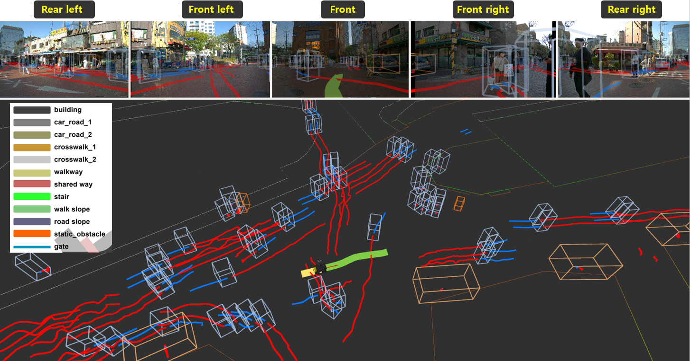
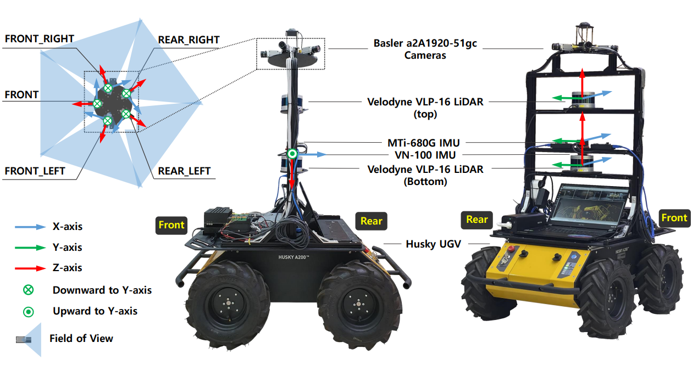

<h1>SiT Dataset: Socially Interactive Pedestrian Trajectory Dataset</h1>



## Updates
* [2023-05-29] We opened SiT Dataset github.
* [2023-05-29] We opened SiT Dataset webpage.

## Upcomings
* [2023-06] SiT Miniset release on public.
* [2023-07] SiT Full dataset upload.
* [2023-07] ROS bagfile of SiT Full dataset upload.
* [2023-07] Pretrained models for 3D object detection.
* [2023-08] SiT benchmark for end-to-end trajectory prediction release.

## Overview
Our Social Interactive Trajectory (SiT) dataset is a unique collection of pedestrian trajectories for designing advanced social navigation robots. It includes a range of sensor data, annotations, and offers a unique perspective from a robot navigating crowded environments, capturing dynamic human-robot interactions. It's meticulously organized for training and evaluating models across tasks like 3D detection, 3D multi-object tracking, and trajectory prediction, providing an end-to-end modular approach. It includes a comprehensive benchmark and exhibits the performance of several baseline models. This dataset is a valuable resource for future pedestrian trajectory prediction research, supporting the development of safe and agile social navigation robots.

## Robot Platform & Sensor Setup


* <a href="https://clearpathrobotics.com/husky-unmanned-ground-vehicle-robot/"> Clearpath Husky UGV </a>
* Velodyne VLP-16 * 2
* RGB Camera Basler a2A1920-51gv PRO GigE * 5
* MIi-680 IMU & GPS


### 3D Object Detection
This is the document for how to use our dataset for various perception tasks.
We tested the SiT Dataset for detection frameworks on the following enviroment:
* Python 3.8.13 (3.10+ does not support open3d.)
* Ubuntu 18.04/20.04
* Torch 1.11.0+cu113
* CUDA 11.3
* opencv 4.2.0.32

### 3D Multi-Object Tracking(3DMOT)
This is the document for how to use our dataset for various perception tasks.
We tested the SiT Dataset for Tracking frameworks on the following enviroment:
* Python 3.8.13 (3.10+ does not support open3d.)
* Ubuntu 18.04/20.04
* Torch 1.11.0+cu113
* CUDA 11.3
* opencv 4.2.0.32

### Pedestrian Trajectory Prediction
This is the document for how to use our dataset for various perception tasks.
We tested the SiT Dataset for prediction frameworks on the following enviroment:
* Python 3.8.13 (3.10+ does not support open3d.)
* Ubuntu 18.04/20.04
* Torch 1.11.0+cu113
* CUDA 11.3
* opencv 4.2.0.32

<!-- 

## Model Zoo
We provide pretrained models for 3D pedestrian detection, Pedestrian Trajectory Prediction and end-to-end Prediction.
### 3D Object Detection
|Modal|Name|mAP| dist 0.25 |dist 0.5 | dist 1.0 | dist 2.0 | -  | - | Pretrained |
|:---:|:---:|:---:|:---:|:---:|:---:|:---:|:---:|:---:|:---:|
|Camera|FCOS3D| - | - | - | - | - | - | - |<a href="">Link</a>|
|Camera|BEVFormer| - | - | - | - | - | - | - |<a href="">Link</a>|
|LiDAR|PointPillars| - | - | - | - | - | - | - |<a href="">Link</a>|
|LiDAR|SECOND| - | - | - | - | - | - | - |<a href="">Link</a>|
|LiDAR|CenterPoint| - | - | - | - | - | - | - |<a href="">Link</a>|
|Fusion|Transfusion| - | - | - | - | - | - | - |<a href="">Link</a>|
|Fusion|BEVFusion| - | - | - | - | - | - | - |<a href="">Link</a>|

### Pedestrian Trajectory Prediction
|Name|Map|ADE|FDE| - | - | - | - | - |Pretrained|
|:---:|:---:|:---:|:---:|:---:|:---:|:---:|:---:|:---:|:---:|
|Vanilla LSTM|x| - | - | - | - | - | - | - |<a href="">Link</a>|
|Social-LSTM|x| - | - | - | - | - | - | - |<a href="">Link</a>|
|Y-NET|x| - | - | - | - | - | - | - |<a href="">Link</a>|
|Y-NET|o| - | - | - | - | - | - | - |<a href="">Link</a>|
|NSP|x| - | - | - | - | - | - | - |<a href="">Link</a>|
|NSP|o| - | - | - | - | - | - | - |<a href="">Link</a>|

### End-to-End Pedestrian Trajectory Prediction
|Name|Map| AP | FAP_MR | AR | FAP | FAR | AAP | AAR | ATE | ASE | AOE | AVE | AAE | ADE | FDE | MR |Pretrained|
|:---:|:---:|:---:|:---:|:---:|:---:|:---:|:---:|:---:|:---:|:---:|:---:|:---:|:---:|:---:|:---:|:---:|:---:|
|FaF|x| - | - | - | - | - | - | - | - | - | - | - | - | - | - | - |<a href="">Link</a>|
|FutureDet|x| - | - | - | - | - | - | - | - | - | - | - | - | - | - | - |<a href="">Link</a>|
|FutureDet|o| - | - | - | - | - | - | - | - | - | - | - | - | - | - | - |<a href="">Link</a>|
 -->
## Download Dataset (TBD)
Download full dataset and raw rosbag files from below.
<a href="https://github.com/SPALaboratory/SiT-Dataset"> Download link </a>


## ROS Bag Raw Data
ROS bagfiles include below sensor data:
Topic Name | Message Tpye | Message Descriptison
------------ | ------------- | ---------------------------------
/29_camera/pylon_camera_node/image_raw/compressed  | sensor_msgs/CompressedImage  | Compressed Bayer Image by Basler a2A1920-51gv PRO GigE
/41_camera/pylon_camera_node/image_raw/compressed  | sensor_msgs/CompressedImage  | Compressed Bayer Image by Basler a2A1920-51gv PRO GigE
/46_camera/pylon_camera_node/image_raw/compressed  | sensor_msgs/CompressedImage  | Compressed Bayer Image by Basler a2A1920-51gv PRO GigE
/47_camera/pylon_camera_node/image_raw/compressed  | sensor_msgs/CompressedImage  | Compressed Bayer Image by Basler a2A1920-51gv PRO GigE
/65_camera/pylon_camera_node/image_raw/compressed  | sensor_msgs/CompressedImage  | Compressed Bayer Image by Basler a2A1920-51gv PRO GigE
/bottom/velodyne_points | sensor_msgs/PointCloud2 | Pointcloud by Velodyne VLP-16
/top/velodyne_points | sensor_msgs/PointCloud2 | Pointcloud by Velodyne VLP-16
/xsens/filter/positionlla  | geometry_msgs/Vector3Stamped | GNSS by MIi-680
/xsens/imu/data      | sensor_msgs/Imu | GNSS by MTi-680
 /xsens/imu_interpolated   | | sensor_msgs/Imu | GNSS by MTi-680

## License <a rel="license_cc" href="http://creativecommons.org/licenses/by-nc-nd/4.0/"></a> <a rel="license_apache_2"></a>

The SiT dataset is published under the CC BY-NC-ND License 4.0, and all codes are published under the Apache License 2.0.
<!-- 

## Citation
```
@misc{sitdataset,
      title={SiT Dataset: Data, Benchmarks and Analysis}, 
      author={Jongwook Bae, Jungho Kim, Junyong Yun, Changwon Kang, Junho Lee, Jeongseon Choi, Chanhyeok Kim, and Jun-Won Choi},
      year={2023},
      eprint={},
      archivePrefix={arXiv},
      primaryClass={cs.CV}
}
``` -->

## Acknowledgement
The SiT dataset is contributed by [Jongwook Bae](https://github.com/Eddie-JUB), [Jungho Kim](https://github.com/SPA-junghokim), [Junyong Yun](https://github.com/JunyongYun-SPA), [Changwon Kang](https://github.com/rkdckddnjs9), [Junho Lee](https://github.com/jhlee-ai), [Jeongseon Choi](https://github.com/junction824), [Chanhyeok Kim](), [Jungwook Choi](https://jchoi-hyu.github.io/), advised by [Jun-Won Choi](https://www.spa.hanyang.ac.kr/faculty).
<!--다른 모델 저자들 링크  -->
We thank the maintainers of the following projects that enable us to develop SiT Dataset: [`MMDetection`](https://github.com/open-mmlab/mmdetection) by MMLAB
